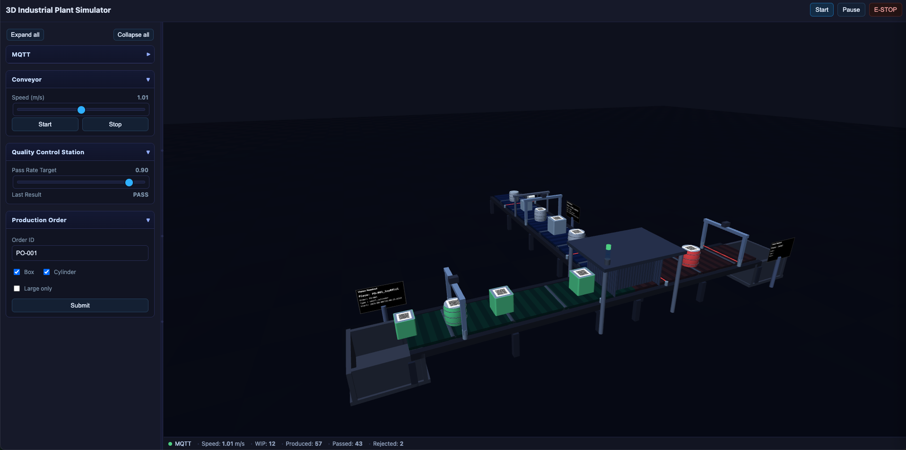

<h1 align="center">3D Industrial Plant Simulator</h1>

<p align="center">
  A browser-based 3D conveyor line with realistic sensors and MQTT over WebSockets — all in a single HTML file.
  <br/>
  <em>Three.js + mqtt.js • Real QR codes on parts • Photoeyes • Vision gates • Production orders</em>
</p>

<p align="center">
  
</p>

## Highlights
- Detailed conveyors (main + two branches) with moving belt textures and diverter gate
- Items with unique IDs prefixed by order ID, e.g. `PO-001_ab12cd34`
- Real, scannable QR code decal on each piece (qrcode-generator)
- Sensors:
  - Conveyor speed (analog)
  - Photoelectric sensors (start/end on each belt) with visible beam
  - Vision gates (A start, B end, C end) reading the QR payload
  - QC proximity and last result
- Production Order widget: set `orderID`, choose Box/Cylinder and Large only — affects spawned parts only
- MQTT over WebSockets with JSON payloads AND per-field subtopics
- Single-file web app, no build; optional Dockerized Mosquitto for local WS MQTT

## Quickstart

Serve the static files and open the app in your browser.

Option A (Python):

```bash
python3 -m http.server 5173
# open http://localhost:5173/index.html
```

Option B (VS Code):
- Use the provided task “Serve: Python http.server” or a Live Server extension.

Optional: run a local MQTT broker over WebSockets via Docker:

```bash
chmod +x ./start_mosquitto.sh
./start_mosquitto.sh
# Broker WS URL: ws://localhost:9001
```

Then click “Connect” in the app (defaults to `ws://localhost:9001`, with fallback to a public EMQX WS broker).

## Controls at a glance
- Start / Pause / E‑STOP
- Conveyor speed slider (also publishes a setpoint topic)
- QC pass‑rate slider
- Production Order widget
  - `Order ID` text input (prefix for piece IDs)
  - Checkboxes: `Box`, `Cylinder`, `Large only`
  - `Submit` applies to future spawns only

## Item identity & QR payload
Each spawned piece carries a tag and a matching QR code encoding this JSON:

```json
{
  "pieceID": "PO-001_ab12cd34",
  "orderID": "PO-001",
  "type": "large_cylinder",
  "start_timestamp": "2025-08-08T12:34:56.789Z"
}
```

The visual QR is generated client-side and is scannable with standard QR readers.

## MQTT topics
Base topic is configurable (default `plant`). JSON payloads are published at the base topic and each field is also published to subtopics (base/<field>) as scalars.

Sensors (examples):
- Speed: `plant/production/conveyor01/sensors/speed`
  ```json
  { "timestamp": "…", "value": 0.73, "unit": "m/s", "quality": "good", "alarm_state": "normal" }
  ```
  Subtopics: `/timestamp`, `/value`, `/unit`, `/quality`, `/alarm_state`

- Photoeyes: `plant/production/beltA/sensors/photoeye_start` (and `_end`, for B/C belts)
  ```json
  { "timestamp": "…", "value": 1, "unit": "bool", "quality": "good", "alarm_state": "normal" }
  ```

- Vision gates: `plant/production/beltA/sensors/vision_start` (and `vision_end` on B/C)
  ```json
  { "timestamp": "…", "pieceID": "PO-001_ab12cd34", "orderID": "PO-001", "type": "large_cylinder", "start_timestamp": "…" }
  ```
  When no item is seen, the same schema is sent with empty strings for fields (never `null`).

Other:
- QC proximity: `plant/production/qc01/sensors/proximity`
- QC last result: `plant/production/qc01/sensors/quality`
- E‑STOP status: `plant/safety/emergency_stop/sensors/status`
- Heartbeat: `plant/system/simulator/metrics/heartbeat`

Actuators (subscribed):
- Conveyor speed setpoint: `plant/production/conveyor01/actuators/speed_setpoint`
  ```json
  { "timestamp": "…", "value": 1.0, "unit": "m/s" }
  ```

## Tech stack
- Three.js r128, OrbitControls
- mqtt.js (WebSockets)
- qrcode-generator (client-side QR)

## Troubleshooting
- Blank page: ensure WebGL is enabled and use a local server (file:// won’t load modules consistently).
- MQTT won’t connect: start the Dockerized Mosquitto or use another WS broker; check CORS and WS URL.
- Vision payloads are empty: make sure items are passing through the gate; adjust speed if needed.

## License
This project is provided as-is for demo/education purposes.
